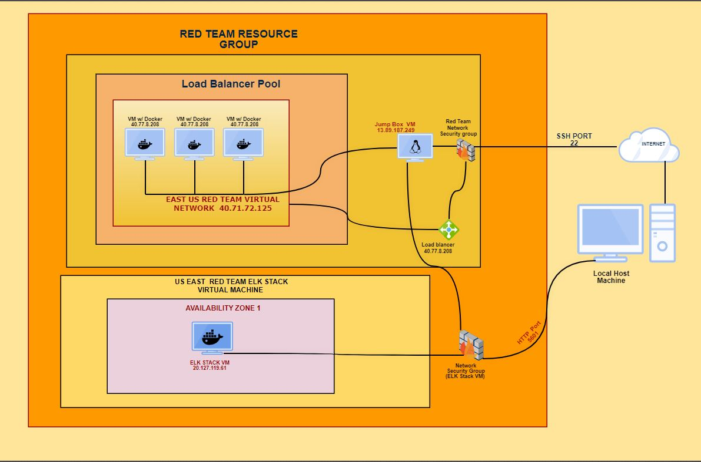

## Automated ELK Stack Deployment

  

The files in this repository were used to configure the network depicted below.

  

**Note**: The following image link needs to be updated. Replace `diagram_filename.png` with the name of your diagram image file.

  

  

These files have been tested and used to generate a live ELK deployment on Azure. They can be used to either recreate the entire deployment pictured above. Alternatively, select portions of the playbook file may be used to install only certain pieces of it, such as Filebeat.

  

- Metricbeat Playbook
- Filebeat Playbook
- Install Elk 

  

This document contains the following details:

- Description of the Topologu

- Access Policies

- ELK Configuration

- Beats in Use

- Machines Being Monitored

- How to Use the Ansible Build

  
  

### Description of the Topology

  

The main purpose of this network is to expose a load-balanced and monitored instance of DVWA, the D*mn Vulnerable Web Application.

  

Load balancing ensures that the application will be highly accessible, in addition to restricting traffic to the network.

-  an organization against distributed denial-of-service (DDoS) attacks. What is the advantage of a jump box?_

  

Integrating an ELK server allows users to easily monitor the vulnerable VMs for changes to the event  logs  and system system metrics.

- Filebeat monitors specific log directiores of log files, collects information and then logs the data.

-    Metricbeat collects metrics and statistics and sends them to things such as Logstash. The output data can then be viewed in things such as Kibana.

  

The configuration details of each machine may be found below.

_Note: Use the [Markdown Table Generator](http://www.tablesgenerator.com/markdown_tables) to add/remove values from the table_.

  

| Name | Function | IP Address | Operating System |
|----------|----------|------------|------------------|
| Jump Box | Gateway | 10.0.0.4 | Linux |
| Web 1  | Web app host  | 10.0.0.5 |Linux |
|Web 2  | Web app host |10.0.0.6 | Linux  |
| Web 3 | Redundancy web app host |10.0.0.10 |Linux |
|Elk Server | Elk Stack |10.2.0.4| Linux 
  

### Access Policies

  

The machines on the internal network are not exposed to the public Internet.

  

Only the Jump Box machine can accept connections from the Internet. Access to this machine is only allowed from the following IP addresses:

-   System Administrator public IP
  

Machines within the network can only be accessed by Jump Box Provisioner . 

-   The ELK VM can be accessed only from Jump Box Provisioner 10.0.0.4 IP address.
  

A summary of the access policies in place can be found in the table below.

  

| Name | Publicly Accessible | Allowed IP Addresses |
|----------|---------------------|----------------------|
| Jump Box | Yes/No |System Administrator Public IP |
|Web 1  |Yes | Load Balancer IP |
| Web 2 | Yes |Load Balancer IP | 
| Web 3 | Yes| Load Balancer IP | 
|Elk Server| No | 10.0.04 (Jump Box IP)|

  

### Elk Configuration

  

Ansible was used to automate configuration of the ELK machine. No configuration was performed manually, which is advantageous because saves time for deployment and reduces the protentional errors, also it makes process of troubleshooting easier.

The playbook implements the following tasks:

-  _TODO: In 3-5 bullets, explain the steps of the ELK installation play. E.g., install Docker; download image; etc._

-   Install docker.io
-   Install python and dependencies
-   Increase and use more virtual memory
-   Download and launch the elk container 

  

The following screenshot displays the result of running `docker ps` after successfully configuring the ELK instance.

  

! [Docker] (Images/DOCKER ID.JPG)

 

  

### Target Machines & Beats

This ELK server is configured to monitor the following machines:

- 10.0.0.5 (Web 1)
- 10.0.0.6 (Web 2)
- 10.0.0.10 (Web 3)
  

We have installed the following Beats on these machines:

-  Filebeat 
- Metricbeat

  

These Beats allow us to collect the following information from each machine:

- Filebeat collects auth logs `(/var/log/auth.log)`, which can be used to monitor access attempts.
- Metricbeat collects metrics related to CPU, memory and running proccessing, which can be used to optimize the computer speed and efficiency and detect any unwanted breaches.

### Using the Playbook

In order to use the playbook, you will need to have an Ansible control node already configured. Assuming you have such a control node provisioned:

  

SSH into the control node and follow the steps below:

- Copy the configuration file to control node.

- Update the host file to include target machines 

- Run the playbook, and navigate to http://[your.VM.IP]:5601/app/kibana to check that the installation worked as expected.

  
- Copy install-elk.yml to /etc/ansible
- Update hosts file to specify which machine to install the ELK server.
- Navigate to http://[your.VM.IP]:5601/app/kibana to check that the ELK server is running.

- Clone the repo on the control machine: git clone https://github.com/svetkrasin/ELK_Stack.git 
- Update hosts file
- run ansible-playbook install-elk.yml in order to deploy ELK server.
